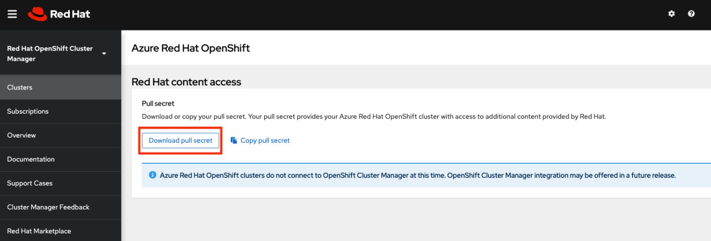

# Environment setup on your Linux VM `do it once`
<br /><br />


```
az account set --subscription <SUBSCRIPTION ID>
az provider register -n Microsoft.RedHatOpenShift --wait
az provider register -n Microsoft.Compute --wait
az provider register -n Microsoft.Storage --wait
```

<br /><br />


# Enable your cluster to access Red Hat Container Registries along with additional content
<br /><br />


Navigate to your Red Hat OpenShift cluster manager portal and log in.
https://cloud.redhat.com/openshift/install/azure/aro-provisioned

Click Download pull secret and download a pull secret to be used with your ARO cluster.
https://docs.microsoft.com/en-us/azure/openshift/tutorial-create-cluster




<br /><br />


# LAB
<br /><br />

# Save variables in file `param.sh`
```
LOCATION=eastus                 # the location of your cluster
RESOURCEGROUP=aro-rg            # the name of the resource group where you want to create your cluster
CLUSTER=cluster                 # the name of your cluster
```


<br /><br />


# Deploy ARO Cluster `deploy.sh`

```
##!/usr/bin/env bash
set -e
. ./params.sh


# Create Resource Group
az group create \
  --name $RESOURCEGROUP \
  --location $LOCATION

# Create a virtual network
az network vnet create \
   --resource-group $RESOURCEGROUP \
   --name aro-vnet \
   --address-prefixes 10.0.0.0/22

# Add an empty subnet for the master nodes
az network vnet subnet create \
  --resource-group $RESOURCEGROUP \
  --vnet-name aro-vnet \
  --name master-subnet \
  --address-prefixes 10.0.0.0/23 \
  --service-endpoints Microsoft.ContainerRegistry

# Add an empty subnet for the worker nodes
az network vnet subnet create \
  --resource-group $RESOURCEGROUP \
  --vnet-name aro-vnet \
  --name worker-subnet \
  --address-prefixes 10.0.2.0/23 \
  --service-endpoints Microsoft.ContainerRegistry

# Disable subnet private endpoint policies on the master subnet. This is required for the service to be able to connect to and manage the cluster.
az network vnet subnet update \
  --name master-subnet \
  --resource-group $RESOURCEGROUP \
  --vnet-name aro-vnet \
  --disable-private-link-service-network-policies true


# Create the cluster
az aro create \
  --resource-group $RESOURCEGROUP \
  --name $CLUSTER \
  --vnet aro-vnet \
  --master-subnet master-subnet \
  --worker-subnet worker-subnet \
  --pull-secret @pull-secret.txt
  #--domain foo.example.com

# Connect to the cluster
$ARO_Credentials=$(az aro list-credentials --name $CLUSTER --resource-group $RESOURCEGROUP )
$pass=$(echo $ARO_Credentials | tr -s "," "\n" | tr -d \" | awk '{if (NR==1) {print$3}}' )
$user=$(echo $ARO_Credentials | tr -s "," "\n" | tr -d \"| awk '{if (NR==2) {print$2}}' )


# Find the cluster console URL by running the following command
az aro show \
    --name $CLUSTER \
    --resource-group $RESOURCEGROUP \
    --query "consoleProfile.url" -o tsv

```

<br /><br />

> ## Connect using the OpenShift CLI


<br /><br />

> To use OpenShift 4 CLI do this step just once to install it
```
echo $pass
echo $user
```

<br /><br />

>Contect to web portal using the pass and user. Then in your terminal apply the fallowing comands
```
cd ~
wget https://mirror.openshift.com/pub/openshift-v4/clients/ocp/latest/openshift-client-linux.tar.gz

mkdir openshift
tar -zxvf openshift-client-linux.tar.gz -C openshift
echo 'export PATH=$PATH:~/openshift' >> ~/.bashrc && source ~/.bashrc

```

<br /><br />

> After you install the openshift cli  you can add the bellow lines at the end of `deploy.sh` file to connect automatically via cli to the cluster

```

apiServer=$(az aro show -g $RESOURCEGROUP -n $CLUSTER --query apiserverProfile.url -o tsv)

oc login $apiServer -u $user -p $pass
```

<br /><br />


# Delete ARO Cluster `delete.sh`

```
##!/usr/bin/env bash
set -e
. ./params.sh


az aro delete --resource-group $RESOURCEGROUP --name $CLUSTER
```
