> Azure Policy and OPA Gatekeeper || Create and assign a custom policy using Visual Studio Code Azure Policy extension


**Create and assign a custom policy using Visual Studio Code Azure Policy extension**

 

**Custom Template used to create a custom Policy**

```apiVersion: templates.gatekeeper.sh/v1beta1

kind: ConstraintTemplate

metadata:

  name:** k8sazureblockdefaultcustom**

spec:

  crd:

    spec:

      names:

        kind: K8sAzureBlockDefaultCustom

  targets:

    - target: admission.k8s.gatekeeper.sh

      rego: |

        package k8sazureblockdefaultcustom

 

        violation\[{"msg": msg}\] {

          obj := input.review.object

          is\_default\_namespace(obj.metadata)

          msg := sprintf("Usage of the default namespace is not allowed, name: %v, kind: %v", \[obj.metadata.name, obj.kind\])

        }

 

        is\_default\_namespace(metadata) {

          not metadata.namespace

        }

 

        is\_default\_namespace(metadata) {

          metadata.namespace == "default"

        }
```

 

 

Step1

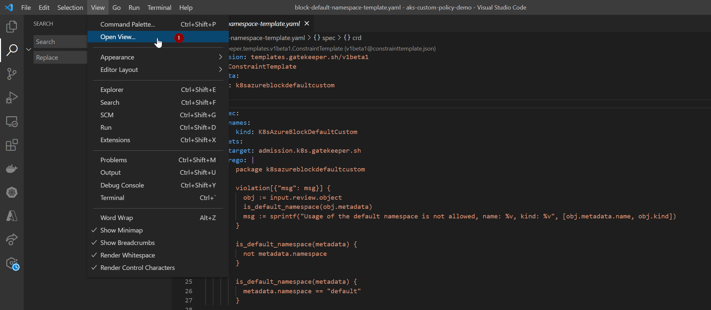


 

Step2


 

 

Step3

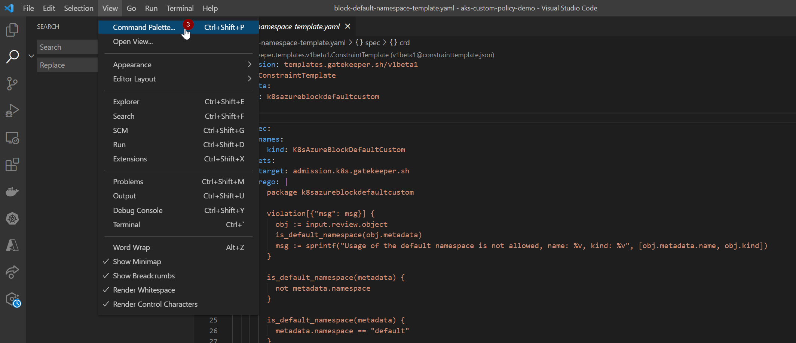

 

 

Step4

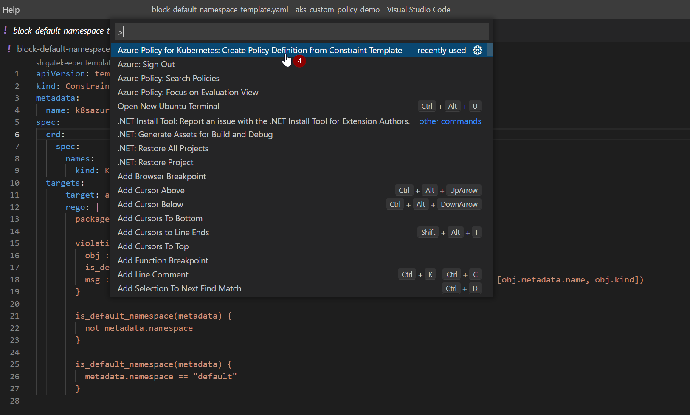

 

 

 

Step5


 

**To Mitigate this follow the steps:**

** **

Step6

 

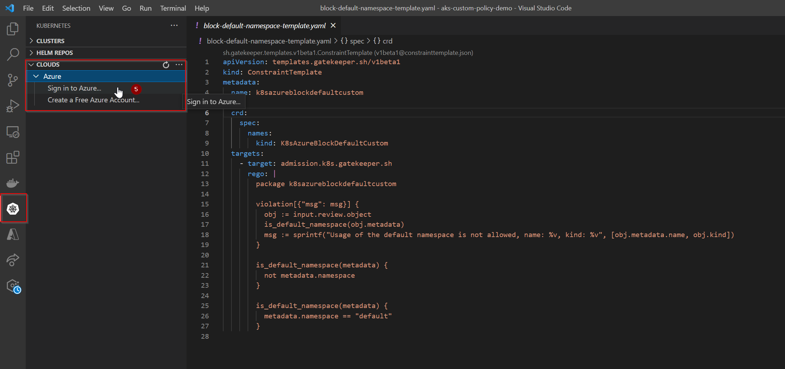

 

 

Step7

 

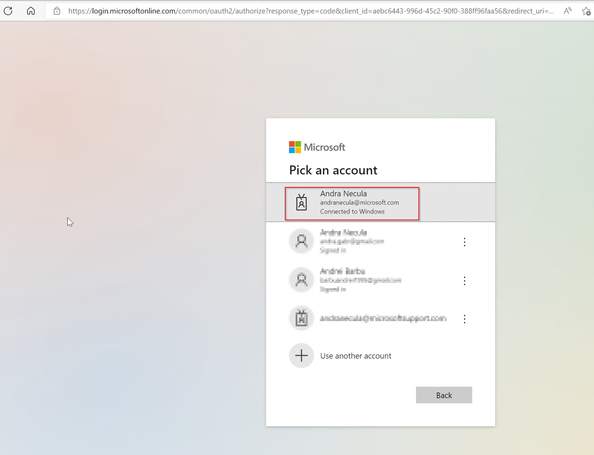

 

Step8

 

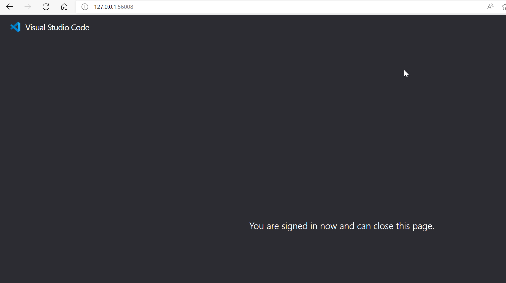

 

Step9

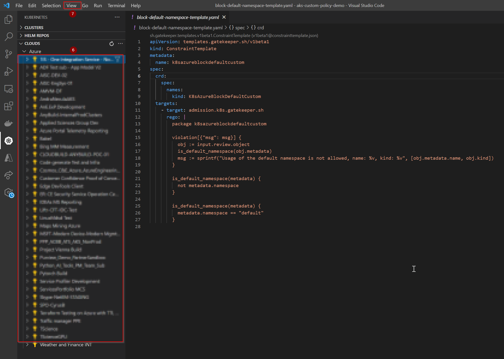

 

 

Step10

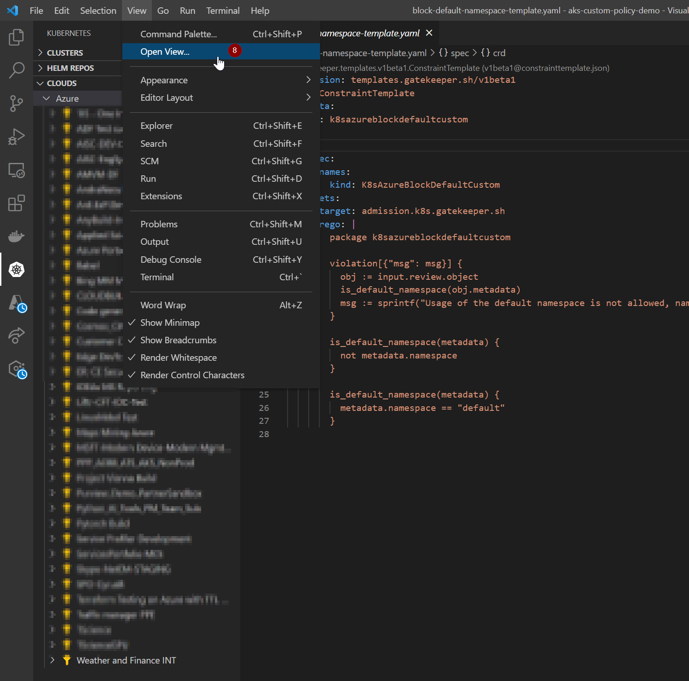

 

 

Step11

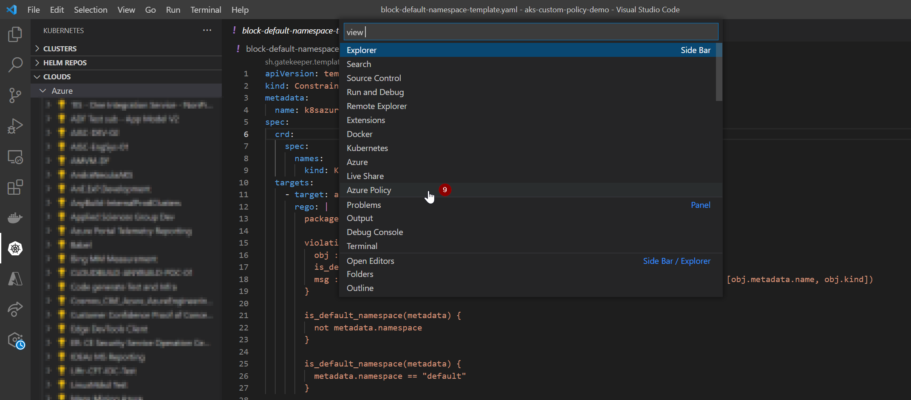

 

 

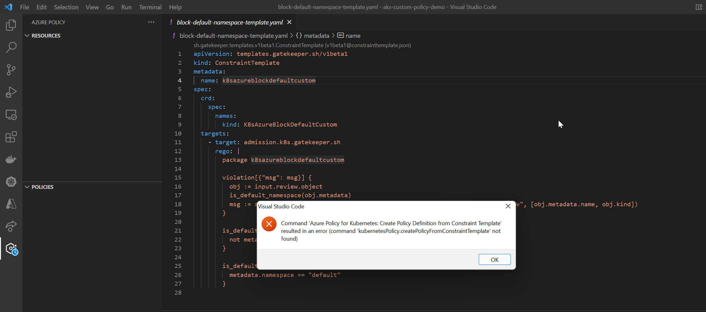

 

** **

**To fix this message again  click on your subscription then again on View/Azure Policy**

 

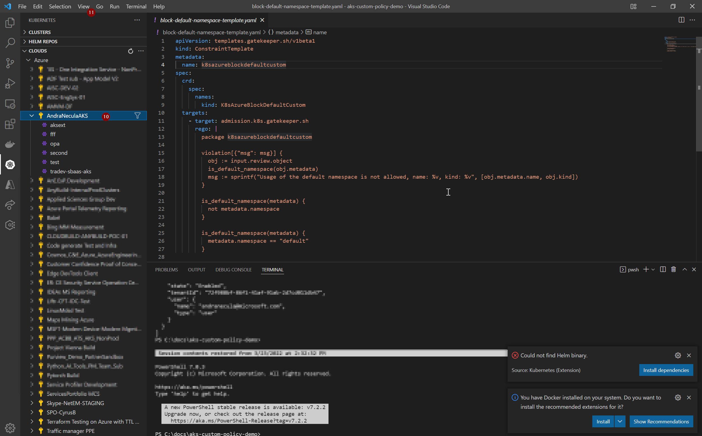

 


 

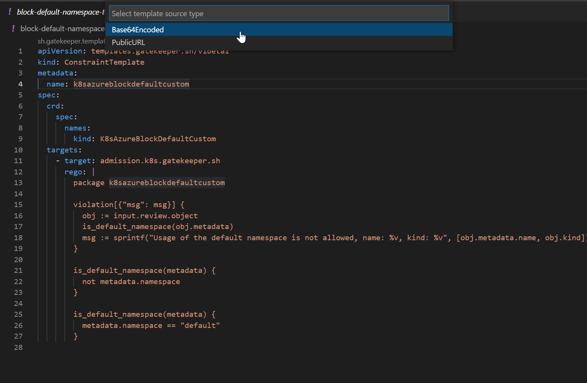

 

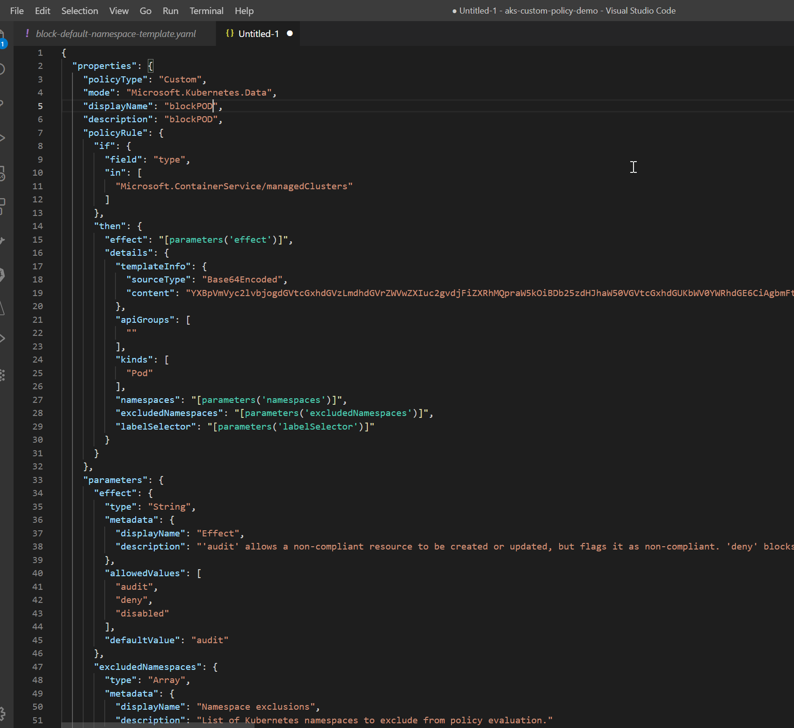

 

 

**Go to Azure Portal, Policy, and create a new policy with the definition generated and edited:**

```{

  "properties": {

    "policyType": "Custom",

    "mode": "Microsoft.Kubernetes.Data",

    "displayName": "blockPOD",

    "description": "blockPOD",

    "policyRule": {

      "if": {

        "field": "type",

        "in": \[

          "Microsoft.ContainerService/managedClusters"

        \]

      },

      "then": {

        "effect": "\[parameters('effect')\]",

        "details": {

          "templateInfo": {

            "sourceType": "Base64Encoded",

            "content": "YXBpVmVyc2lvbjogdGVtcGxhdGVzLmdhdGVrZWVwZXIuc2gvdjFiZXRhMQpraW5kOiBDb25zdHJhaW50VGVtcGxhdGUKbWV0YWRhdGE6CiAgbmFtZTogazhzYXp1cmVibG9ja2RlZmF1bHRjdXN0b20Kc3BlYzoKICBjcmQ6CiAgICBzcGVjOgogICAgICBuYW1lczoKICAgICAgICBraW5kOiBLOHNBenVyZUJsb2NrRGVmYXVsdEN1c3RvbQogIHRhcmdldHM6CiAgICAtIHRhcmdldDogYWRtaXNzaW9uLms4cy5nYXRla2VlcGVyLnNoCiAgICAgIHJlZ286IHwKICAgICAgICBwYWNrYWdlIGs4c2F6dXJlYmxvY2tkZWZhdWx0Y3VzdG9tCgogICAgICAgIHZpb2xhdGlvblt7Im1zZyI6IG1zZ31dIHsKICAgICAgICAgIG9iaiA6PSBpbnB1dC5yZXZpZXcub2JqZWN0CiAgICAgICAgICBpc19kZWZhdWx0X25hbWVzcGFjZShvYmoubWV0YWRhdGEpCiAgICAgICAgICBtc2cgOj0gc3ByaW50ZigiVXNhZ2Ugb2YgdGhlIGRlZmF1bHQgbmFtZXNwYWNlIGlzIG5vdCBhbGxvd2VkLCBuYW1lOiAldiwga2luZDogJXYiLCBbb2JqLm1ldGFkYXRhLm5hbWUsIG9iai5raW5kXSkKICAgICAgICB9CgogICAgICAgIGlzX2RlZmF1bHRfbmFtZXNwYWNlKG1ldGFkYXRhKSB7CiAgICAgICAgICBub3QgbWV0YWRhdGEubmFtZXNwYWNlCiAgICAgICAgfQoKICAgICAgICBpc19kZWZhdWx0X25hbWVzcGFjZShtZXRhZGF0YSkgewogICAgICAgICAgbWV0YWRhdGEubmFtZXNwYWNlID09ICJkZWZhdWx0IgogICAgICAgIH0K"

          },

          "apiGroups": \[

            ""

          \],

          "kinds": \[

            "Pod"

          \],

          "namespaces": "\[parameters('namespaces')\]",

          "excludedNamespaces": "\[parameters('excludedNamespaces')\]",

          "labelSelector": "\[parameters('labelSelector')\]"

        }

      }

    },

    "parameters": {

      "effect": {

        "type": "String",

        "metadata": {

          "displayName": "Effect",

          "description": "'audit' allows a non-compliant resource to be created or updated, but flags it as non-compliant. 'deny' blocks the non-compliant resource creation or update. 'disabled' turns off the policy."

        },

        "allowedValues": \[

          "audit",

          "deny",

          "disabled"

        \],

        "defaultValue": "audit"

      },

      "excludedNamespaces": {

        "type": "Array",

        "metadata": {

          "displayName": "Namespace exclusions",

          "description": "List of Kubernetes namespaces to exclude from policy evaluation."

        },

        "defaultValue": \[

          "kube-system",

          "gatekeeper-system",

          "azure-arc"

        \]

      },

      "namespaces": {

        "type": "Array",

        "metadata": {

          "displayName": "Namespace inclusions",

          "description": "List of Kubernetes namespaces to only include in policy evaluation. An empty list means the policy is applied to all resources in all namespaces."

        },

        "defaultValue": \[\]

      },

      "labelSelector": {

        "type": "Object",

        "metadata": {

          "displayName": "Kubernetes label selector",

          "description": "Label query to select Kubernetes resources for policy evaluation. An empty label selector matches all Kubernetes resources."

        },

        "defaultValue": {},

        "schema": {

          "description": "A label selector is a label query over a set of resources. The result of matchLabels and matchExpressions are ANDed. An empty label selector matches all resources.",

          "type": "object",

          "properties": {

            "matchLabels": {

              "description": "matchLabels is a map of {key,value} pairs.",

              "type": "object",

              "additionalProperties": {

                "type": "string"

              },

              "minProperties": 1

            },

            "matchExpressions": {

              "description": "matchExpressions is a list of values, a key, and an operator.",

              "type": "array",

              "items": {

                "type": "object",

                "properties": {

                  "key": {

                    "description": "key is the label key that the selector applies to.",

                    "type": "string"

                  },

                  "operator": {

                    "description": "operator represents a key's relationship to a set of values.",

                    "type": "string",

                    "enum": \[

                      "In",

                      "NotIn",

                      "Exists",

                      "DoesNotExist"

                    \]

                  },

                  "values": {

                    "description": "values is an array of string values. If the operator is In or NotIn, the values array must be non-empty. If the operator is Exists or DoesNotExist, the values array must be empty.",

                    "type": "array",

                    "items": {

                      "type": "string"

                    }

                  }

                },

                "required": \[

                  "key",

                  "operator"

                \],

                "additionalProperties": false

              },

              "minItems": 1

            }

          },

          "additionalProperties": false

        }

      }

    }

  }

}
```

 

 

** **

**WAIT 30 MINUTES**

** **

**Create pod for testing the Policy**

```apiVersion: v1

kind: Pod

metadata:

  name: nginx-non-privileged

spec:

  containers:

    - name: nginx-non-privileged

      image: mcr.microsoft.com/oss/nginx/nginx:1.15.5-alpine
```

** **

** **

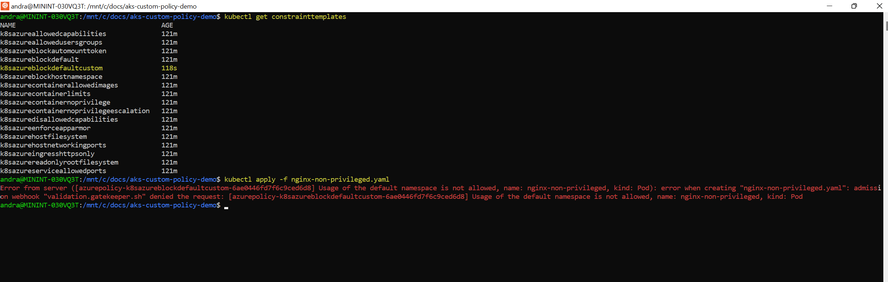

** **

** **
